# Housing Affordability Dashboard, Project plan

## Goals
Build an interactive dashboard for one African city, track housing prices, rents, and incomes, surface neighborhoods with the best affordability.

## Roles and cadence
Two person sprint model. Ian takes a first pass, Kate takes a first pass, then meet for a joint review and final decisions. Weekly thirty minute sync, sprint length two weeks.


---

# How to work each sprint with the two pass rule

1. Create all issues above, add them to the Project, set Sprints to Sprint 0 or Sprint 1, set Pass owner to Ian first pass for the starter on each item.
2. Ian completes a first pass, opens a draft PR, attaches screenshots or logs, then reassigns Pass owner to Kate first pass.
3. Kate completes her pass, pushes commits or leaves review notes, then sets Pass owner to In review and adds time for the end of sprint call in the issue.
4. During the review call, agree on a final version, record decisions, then set Pass owner to Finalized and merge.

---

# Mermaid, repo structure map

Paste into docs/repo_map.mmd, then link it from the README.

```mermaid
flowchart TD
    A[repo root] --> B[docs]
    A --> C[data]
    A --> D[pipelines]
    A --> E[src]
    A --> F[reports]
    A --> G[.github]
    A --> H[notebooks]
    A --> I[app]

    B --> B1[brief.md]
    B --> B2[PROJECT_PLAN.md]
    B --> B3[CHECKLIST.md]
    B --> B4[metrics.md]
    B --> B5[decision_log.md]
    B --> B6[data_catalog.md]
    B --> B7[data_dictionary.md]
    B --> B8[geo.md]
    B --> B9[RUNBOOK.md]
    B --> B10[repo_map.mmd]

    C --> C1[raw]
    C --> C2[processed]
    C --> C3[curated]
    C --> C4[external]
    C1 --> C1a[YYYYMMDD, files]
    C2 --> C2a[tidy CSV and Parquet]
    C3 --> C3a[analysis ready tables]
    C4 --> C4a[boundaries GeoJSON, CRS note]

    D --> D1[ingest_raw.py]
    D --> D2[makefile or taskfile]
    D --> D3[etl_preprocess.py]
    D --> D4[metrics_compute.py]

    E --> E1[utils, io.py]
    E --> E2[utils, geo.py]
    E --> E3[metrics, affordability.py]
    E --> E4[validation, dq_checks.py]

    F --> F1[profile_report.html]
    F --> F2[geo_qc.png]
    F --> F3[screenshots, prototype]

    G --> G1[ISSUE_TEMPLATE]
    G --> G2[PULL_REQUEST_TEMPLATE.md]
    G1 --> G1a[task.yml]

    H --> H1[explore_prices.ipynb]
    H --> H2[explore_rents.ipynb]
    H --> H3[explore_income.ipynb]

    I --> I1[streamlit_app.py]
    I --> I2[assets]
    I --> I3[config]
```

```
housing-affordability-dashboard/
├─ src/                              # Core Python package
│  ├─ utils/
│  │  ├─ io.py                       # I/O utilities (read/write, logging, config)
│  │  └─ geo.py                      # Spatial utilities (joins, CRS, boundaries)
│  ├─ metrics/
│  │  └─ affordability.py            # Core affordability metrics & formulas
│  ├─ validation/
│  │  └─ dq_checks.py                # Data quality & validation checks
│  └─ __init__.py
│
├─ pipelines/                        # Data ingestion and ETL pipelines
│  ├─ ingest_raw.py                  # Raw data download & snapshot saver
│  ├─ etl_preprocess.py              # Clean, merge, and standardize datasets
│  ├─ metrics_compute.py             # Compute derived affordability metrics
│  └─ makefile                       # Task shortcuts (setup, run, test, deploy)
│
├─ notebooks/                        # Exploratory notebooks (EDA & sanity checks)
│  ├─ explore_prices.ipynb
│  ├─ explore_rents.ipynb
│  └─ explore_income.ipynb
│
├─ app/                              # Visualization app
│  ├─ streamlit_app.py               # Main Streamlit entry point
│  ├─ assets/                        # Static assets (images, icons)
│  └─ config/                        # Optional config for theme or environment
│
├─ data/                             # Data layers (gitignored except samples)
│  ├─ raw/                           # Unmodified snapshots (YYYYMMDD folders)
│  ├─ processed/                     # Cleaned and standardized datasets
│  ├─ curated/                       # Analysis-ready datasets
│  └─ external/                      # Boundaries & external geo files (GeoJSON, shapefiles)
│
├─ reports/                          # Generated outputs & visual QC
│  ├─ profile_report.html            # Pandas profiling or summary report
│  ├─ geo_qc.png                     # Spatial join validation map
│  └─ screenshots/                   # Dashboard preview images
│
├─ docs/                             # Project documentation & guides
│  ├─ PROJECT_PLAN.md                # End-to-end roadmap & phases
│  ├─ CHECKLIST.md                   # Master checklist (phased tasks)
│  ├─ brief.md                       # One-page problem & scope summary
│  ├─ metrics.md                     # Metric definitions & formulas
│  ├─ data_catalog.md                # Data sources & license details
│  ├─ data_dictionary.md             # Field-level documentation
│  ├─ geo.md                         # Boundary file details (CRS, fields)
│  ├─ decision_log.md                # Record of team decisions
│  ├─ RUNBOOK.md                     # How to reproduce, rebuild, and deploy
│  └─ repo_map.mmd                   # Mermaid version of this repo tree
│
├─ .github/                          # GitHub management & automation
│  ├─ ISSUE_TEMPLATE/
│  │  └─ task.yml                    # Task issue template
│  ├─ workflows/
│  │  └─ ci.yml                      # Linting or smoke test workflow
│  └─ PULL_REQUEST_TEMPLATE.md       # PR checklist
│
├─ requirements.txt                  # Project dependencies
├─ CODEOWNERS                        # Repository ownership rules
├─ README.md                         # Main project overview
├─ LICENSE                           # License info (e.g., MIT)
├─ .gitignore                        # Ignore data, envs, caches
└─ .env.example                      # Example environment variables file
```
### version 2
```
housing-affordability-dashboard/
├─ src/
│  ├─ data/
│  │  ├─ __init__.py
│  │  └─ knbs_housing.py           # ← loaders + merge logic (build_core_dataset)
│  ├─ metrics/
│  │  └─ affordability.py          # pure functions to add derived metrics
│  ├─ utils/
│  │  ├─ io.py                     # ensure_dir, read_stata wrapper, write_parquet
│  │  └─ geo.py                    # county name/code normalization, boundary joins
│  ├─ validation/
│  │  └─ dq_checks.py              # data quality & sanity checks
│  └─ __init__.py
│
├─ pipelines/
│  ├─ ingest_raw.py                # (optional) copy/snapshot KNBS .dta into data/raw/YYYYMMDD
│  ├─ etl_preprocess.py            # calls src.data.knbs_housing → writes data/processed/
│  ├─ metrics_compute.py           # adds affordability columns → writes data/curated/
│  └─ makefile                     # (optional) per-dir make, kept for now
│
├─ app/
│  ├─ streamlit_app.py             # Streamlit entrypoint (reads data/curated/)
│  ├─ assets/
│  └─ config/
│
├─ notebooks/
│  ├─ explore_prices.ipynb
│  ├─ explore_rents.ipynb
│  └─ explore_income.ipynb
│
├─ data/
│  ├─ raw/
│  │  ├─ 2025-10-12/               # date-stamped snapshot of .dta files (gitignored)
│  │  └─ latest/                   # convenience copy of current snapshot (folder or symlink)
│  ├─ processed/                   # merged, cleaned intermediate outputs
│  ├─ curated/                     # analysis-ready fact tables for viz
│  └─ external/                    # boundaries/geojson/shapefiles
│
├─ reports/
│  ├─ profile_report.html
│  ├─ geo_qc.png
│  └─ screenshots/
│
├─ docs/
│  ├─ PROJECT_PLAN.md
│  ├─ CHECKLIST.md
│  ├─ brief.md
│  ├─ metrics.md
│  ├─ data_catalog.md
│  ├─ data_dictionary.md
│  ├─ geo.md
│  ├─ decision_log.md
│  ├─ RUNBOOK.md
│  └─ repo_map.mmd
│
├─ .github/
│  ├─ ISSUE_TEMPLATE/
│  │  └─ task.yml
│  ├─ workflows/
│  │  └─ ci.yml
│  └─ PULL_REQUEST_TEMPLATE.md
│
├─ Makefile                        # ← root shortcuts: ingest, preprocess, metrics, app
├─ requirements.txt
├─ CODEOWNERS
├─ README.md
├─ LICENSE
├─ .gitignore
└─ .env.example
```



## Sprints and exit criteria

### Sprint 0, Planning and scope
Exit criteria: one page brief, chosen city, metric list with formulas, acceptance criteria for each chart, signed wireframes.

### Sprint 1, Data sourcing
Exit criteria: data catalog with licenses and refresh cadence, raw snapshots saved with date folders, ingestion scripts run locally end to end.

#### Nairobi Housing Dataflow


```
flowchart TD

subgraph Spatial_Base[Spatial & Demographic Base]
CENSUS[2019 Kenya Population & Housing Census (OpenAFRICA)]
BOUNDARIES[WRI / IGISMAP Administrative Boundaries]
end

subgraph Housing_Data[Housing Market & Price Data]
KNBS_RE[KNBS Real Estate Survey]
KBA[KBA Housing Price Index]
HASS[HassConsult Property Index]
KAGGLE[Kaggle Nairobi House Prices Dataset]
CAHF[CAHF Housing Developments]
end

subgraph Income_Data[Income & Consumption Data]
KIHBS[Kenya Integrated Household Budget Survey (KIHBS)]
KENADA[KeNADA Microdata Catalog]
IFPRI[IFPRI Kenya Datasets]
end

subgraph Inflation_Data[Inflation & Deflators]
CPI[KNBS / NSO Kenya CPI (Housing Component)]
CEIC[CEIC Nairobi CPI (Housing)]
end

subgraph Contextual_Data[Contextual & Enrichment Data]
KOD[Kenya Open Data / Knoema]
end

%% Relationships
CENSUS -->|Ward / Subcounty codes| KNBS_RE
CENSUS -->|Spatial join| KAGGLE
CENSUS -->|Spatial join| KIHBS
BOUNDARIES -->|Geometry overlay| CENSUS
BOUNDARIES -->|Mapping layer| KAGGLE

KIHBS -->|Income data join| KNBS_RE
KIHBS -->|Income vs rent| KBA
KIHBS -->|Income distribution| HASS
KENADA -->|Microdata source| KIHBS

CPI -->|Deflate nominal values| KBA
CPI -->|Adjust to real prices| KNBS_RE
CEIC -->|City-specific deflator| KAGGLE

CAHF -->|Housing supply overlay| CENSUS
CAHF -->|Compare with price indices| KBA

KOD -->|Infrastructure, land use| CENSUS
KOD -->|Contextual enrichment| Housing_Data

%% Dashboard integration
subgraph Dashboard[Housing Affordability Dashboard]
DASH[Interactive Dashboard (Power BI / Tableau)]
end

CENSUS --> DASH
Housing_Data --> DASH
Income_Data --> DASH
Inflation_Data --> DASH
Contextual_Data --> DASH
```

### Sprint 2, Preprocessing
Exit criteria: tidy tables ready for analysis, geographic joins validated, currency and inflation adjustments documented, data profile report generated.

### Sprint 3, Analysis and metrics
Exit criteria: affordability metrics computed and tested, sanity checks documented, intermediate curated datasets saved.

### Sprint 4, Visualization prototype
Exit criteria: interactive prototype with map, trends, and compare views, filters working, copy and footnotes drafted.

### Sprint 5, Production and deployment
Exit criteria: hosted app URL, scheduled refresh or manual runbook, README with reproduce steps, final slide deck and demo video.

## Deliverables list
- Brief, wireframes, decision log
- Data catalog, raw snapshots, ingestion scripts
- Tidy tables, data profile report
- Metrics notebook, tests, curated datasets
- Prototype dashboard screenshots, usability notes
- Hosted app URL, reproduce guide, final slides, short demo video

## Decision log
Date, topic, options considered, decision, owner, rationale, follow ups.

## Risks and mitigations
Data coverage gaps, mitigation: show data vintage, add disclaimers, pick alternate source if needed.
Unstable listings data, mitigation: snapshot with date folders, keep a small local cache.
Time creep, mitigation: keep scope to three to five key visuals, cut extras, meet weekly to unblock.
