# Housing Affordability Dashboard, Project plan

## Goals
Build an interactive dashboard for one African city, track housing prices, rents, and incomes, surface neighborhoods with the best affordability.

## Roles and cadence
Two person sprint model. Ian takes a first pass, Kate takes a first pass, then meet for a joint review and final decisions. Weekly thirty minute sync, sprint length two weeks.

---

# How to work each sprint with the two pass rule

1. Create all issues above, add them to the Project, set Sprints to Sprint 0 or Sprint 1, set Pass owner to Ian first pass for the starter on each item.
2. Ian completes a first pass, opens a draft PR, attaches screenshots or logs, then reassigns Pass owner to Kate first pass.
3. Kate completes her pass, pushes commits or leaves review notes, then sets Pass owner to In review and adds time for the end of sprint call in the issue.
4. During the review call, agree on a final version, record decisions, then set Pass owner to Finalized and merge.

---

# Mermaid, repo structure map

Paste into docs/repo_map.mmd, then link it from the README.

```mermaid
flowchart TD
    A[repo root] --> B[docs]
    A --> C[data]
    A --> D[pipelines]
    A --> E[src]
    A --> F[reports]
    A --> G[.github]
    A --> H[notebooks]
    A --> I[app]

    B --> B1[brief.md]
    B --> B2[PROJECT_PLAN.md]
    B --> B3[CHECKLIST.md]
    B --> B4[metrics.md]
    B --> B5[decision_log.md]
    B --> B6[data_catalog.md]
    B --> B7[data_dictionary.md]
    B --> B8[geo.md]
    B --> B9[RUNBOOK.md]
    B --> B10[repo_map.mmd]

    C --> C1[raw]
    C --> C2[processed]
    C --> C3[curated]
    C --> C4[external]
    C1 --> C1a[YYYYMMDD, files]
    C2 --> C2a[tidy CSV and Parquet]
    C3 --> C3a[analysis ready tables]
    C4 --> C4a[boundaries GeoJSON, CRS note]

    D --> D1[ingest_raw.py]
    D --> D2[makefile or taskfile]
    D --> D3[etl_preprocess.py]
    D --> D4[metrics_compute.py]

    E --> E1[utils, io.py]
    E --> E2[utils, geo.py]
    E --> E3[metrics, affordability.py]
    E --> E4[validation, dq_checks.py]

    F --> F1[profile_report.html]
    F --> F2[geo_qc.png]
    F --> F3[screenshots, prototype]

    G --> G1[ISSUE_TEMPLATE]
    G --> G2[PULL_REQUEST_TEMPLATE.md]
    G1 --> G1a[task.yml]

    H --> H1[explore_prices.ipynb]
    H --> H2[explore_rents.ipynb]
    H --> H3[explore_income.ipynb]

    I --> I1[streamlit_app.py]
    I --> I2[assets]
    I --> I3[config]
```

## Sprints and exit criteria

### Sprint 0, Planning and scope
Exit criteria: one page brief, chosen city, metric list with formulas, acceptance criteria for each chart, signed wireframes.

### Sprint 1, Data sourcing
Exit criteria: data catalog with licenses and refresh cadence, raw snapshots saved with date folders, ingestion scripts run locally end to end.

### Sprint 2, Preprocessing
Exit criteria: tidy tables ready for analysis, geographic joins validated, currency and inflation adjustments documented, data profile report generated.

### Sprint 3, Analysis and metrics
Exit criteria: affordability metrics computed and tested, sanity checks documented, intermediate curated datasets saved.

### Sprint 4, Visualization prototype
Exit criteria: interactive prototype with map, trends, and compare views, filters working, copy and footnotes drafted.

### Sprint 5, Production and deployment
Exit criteria: hosted app URL, scheduled refresh or manual runbook, README with reproduce steps, final slide deck and demo video.

## Deliverables list
- Brief, wireframes, decision log
- Data catalog, raw snapshots, ingestion scripts
- Tidy tables, data profile report
- Metrics notebook, tests, curated datasets
- Prototype dashboard screenshots, usability notes
- Hosted app URL, reproduce guide, final slides, short demo video

## Decision log
Date, topic, options considered, decision, owner, rationale, follow ups.

## Risks and mitigations
Data coverage gaps, mitigation: show data vintage, add disclaimers, pick alternate source if needed.
Unstable listings data, mitigation: snapshot with date folders, keep a small local cache.
Time creep, mitigation: keep scope to three to five key visuals, cut extras, meet weekly to unblock.

